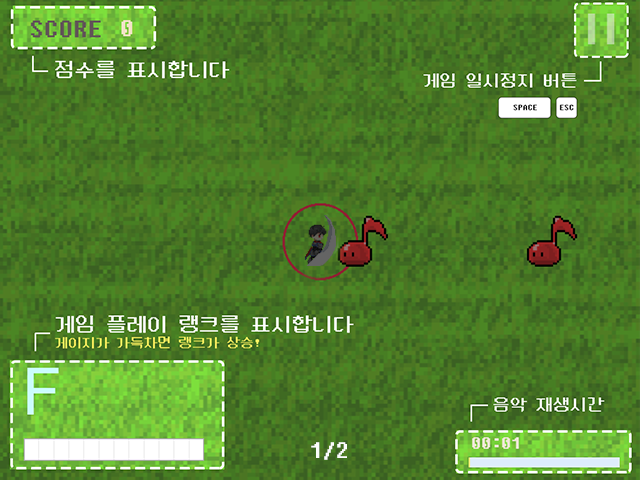
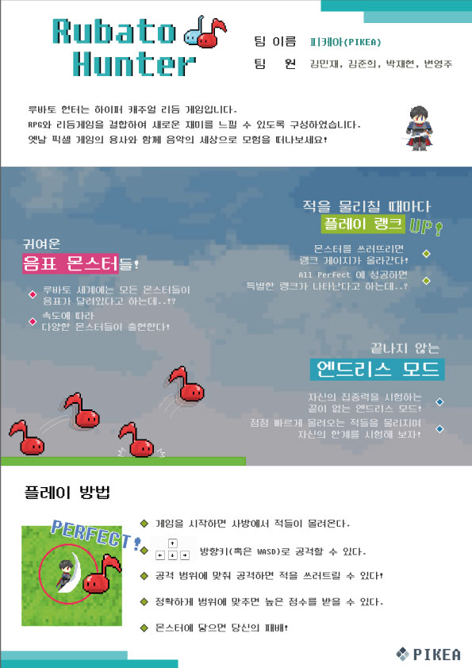

# 루바토헌터

루바토 헌터는 하이퍼 캐주얼 리듬 게임입니다.
RPG와 리듬게임을 결합하여 새로운 재미를 느낄 수 있도록 구성하였습니다.
옛날 픽셀 게임의 용사와 함께 음악의 세상으로 모음을 떠나보세요!

---
### 게임 특징

1. 적을 물리칠 때마다 **랭크 Up!**
- 몬스터를 쓰러뜨리면 랭크 게이지가 올라간다!
- All Perfect에 성공하면 특별한 랭크가 나타난다고 하는데..?

2. 귀여운 **음표 몬스터들**
- 루바토 세계에는 모든 몬스터가 음표가 달려있다..!?
- 속도에 따라 다양한 몬스터들이 출현한다!
  
3. 끝나지 않는 **엔드리스 모드**
- 자신의 집중력을 시험하는 끝이 없는 엔드리스 모드!
- 점점 빠르게 몰려오는 적들을 물리치며 자신의 한계를 시험해 보자!

---
### 플레이 방법
1. 게임이 시작하면 사방에서 적들이 몰려온다.
2. 방향키(혹은 WASD)로 공격할 수 있다.
3. 공격 범위에 맞춰 공격하면 적을 쓰러트릴 수 있다!
4. 정확하게 범위에 맞추면 높은 점수를 받을 수 있다.
5. 몬스터에 닿으면 당신의 패배!

---
### 관련 이미지

